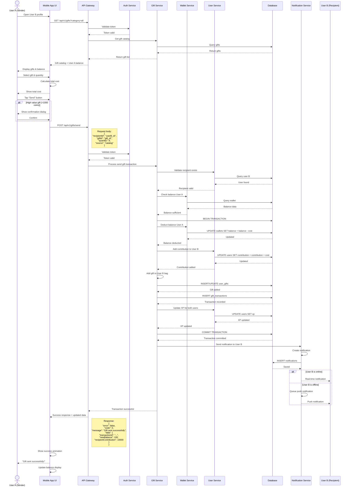
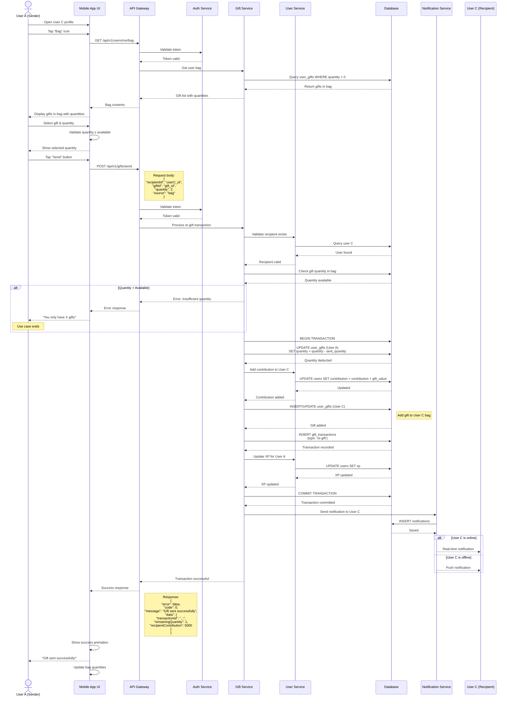
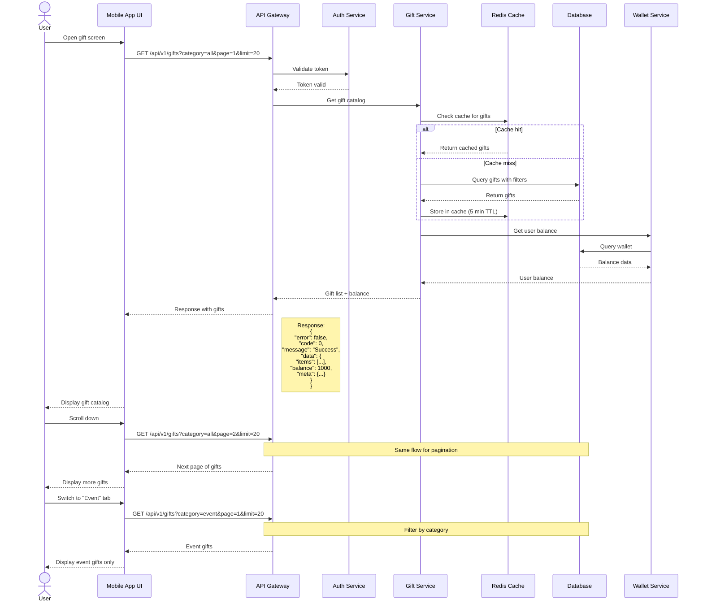
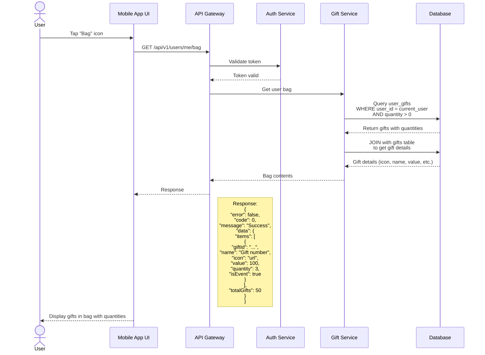

# TÀI LIỆU ĐẶC TẢ FEATURE: GIFT SYSTEM

## 1. FUNCTIONAL REQUIREMENTS (FR)

### FR-001: Hiển thị danh sách Gift có sẵn
**Mô tả ngắn gọn:** Hệ thống hiển thị catalog các loại gift có thể gửi cho user khác.

**Mô tả chi tiết:**
- Hiển thị danh sách gifts với thông tin:
  - Icon/ảnh của gift
  - Tên gift (Gift number)
  - Giá trị (số coin) của gift
  - Badge "Event" nếu là gift đặc biệt
- Gifts được sắp xếp theo danh mục/loại
- Hiển thị balance hiện tại của user (ví dụ: 💎100)
- Hỗ trợ scroll để xem thêm gifts

**Sub-requirements:**
- Filter theo tab: Hot, Event, Lucky, Friendship, Vip
- Hiển thị badge "Event" cho gift đặc biệt
- Load lazy để tối ưu performance

**Acceptance Criteria:**
1. User thấy được tất cả gifts available trong catalog
2. Giá trị của mỗi gift hiển thị chính xác
3. Balance hiện tại của user được hiển thị đúng
4. Gifts có badge "Event" được đánh dấu rõ ràng

---

### FR-002: Chọn số lượng Gift để gửi
**Mô tả ngắn gọn:** User có thể chọn số lượng gift muốn gửi với các tùy chọn quick select.

**Mô tả chi tiết:**
- User chọn 1 loại gift từ catalog
- Hệ thống cung cấp quick select buttons: 1, 9, 99
- User có thể nhập custom số lượng
- Hiển thị tổng giá trị cần thanh toán (số lượng × giá gift)
- Highlight số lượng đang được chọn

**Sub-requirements:**
- Quick select buttons: 1, 9, 99
- Custom input cho số lượng khác
- Real-time tính toán tổng giá trị
- Validate số lượng > 0

**Acceptance Criteria:**
1. User có thể chọn nhanh số lượng 1, 9, hoặc 99
2. User có thể nhập số lượng tùy chỉnh
3. Tổng giá trị được tính và hiển thị chính xác
4. Không thể chọn số lượng ≤ 0

---

### FR-003: Gửi Gift từ Catalog (Mua và gửi trực tiếp)
**Mô tả ngắn gọn:** User có thể mua và gửi gift trực tiếp từ catalog đến user khác.

**Mô tả chi tiết:**
- User chọn gift và số lượng từ catalog
- User nhấn button "Send" (màu hồng)
- Hệ thống validate:
  - Balance đủ để mua gift
  - User recipient tồn tại và active
  - Số lượng hợp lệ
- Xử lý transaction:
  - Trừ balance của sender
  - Cộng contribution points cho recipient
  - Tạo transaction record
  - Cập nhật XP cho cả 2 users
- Hiển thị animation và confirmation
- Gửi real-time notification cho recipient

**Sub-requirements:**
- Validate balance trước khi gửi
- Confirmation dialog cho gift có giá trị cao (>1000 coins)
- Animation khi gửi thành công
- Real-time notification
- Error handling cho các trường hợp lỗi

**Acceptance Criteria:**
1. User không thể gửi nếu balance không đủ
2. Gift gửi thành công → trừ balance sender, cộng contribution recipient
3. Transaction được ghi nhận trong database
4. Recipient nhận được notification real-time
5. Animation hiển thị khi gửi thành công

---

### FR-004: Xem Gift trong Bag (Inventory)
**Mô tả ngắn gọn:** User có thể xem các gift đã nhận được và lưu trong bag.

**Mô tả chi tiết:**
- User mở "Bag" tab từ profile screen
- Hệ thống hiển thị danh sách gifts trong inventory:
  - Icon/ảnh của gift
  - Tên gift
  - Số lượng đang sở hữu (x1, x3, etc.)
  - Badge "Event" nếu có
- Chỉ hiển thị gifts có số lượng > 0
- Hỗ trợ scroll để xem tất cả gifts

**Sub-requirements:**
- Filter/sort gifts trong bag
- Hiển thị số lượng của mỗi loại gift
- Highlight gift đang được chọn
- Quick access từ profile screen

**Acceptance Criteria:**
1. Chỉ hiển thị gifts có số lượng > 0 trong bag
2. Số lượng của mỗi gift hiển thị chính xác
3. Gifts được update real-time khi nhận được gift mới
4. UI tương tự catalog nhưng hiển thị số lượng thay vì giá

---

### FR-005: Gửi Gift từ Bag (Re-gift)
**Mô tả ngắn gọn:** User có thể gửi lại gift từ bag của mình cho user khác.

**Mô tả chi tiết:**
- User chọn gift từ bag
- User chọn số lượng muốn gửi (quick select: 1, 2, 3 hoặc custom)
- Validate số lượng không vượt quá số lượng đang có
- User nhấn "Send"
- Hệ thống xử lý:
  - Trừ số lượng gift từ bag của sender
  - Cộng gift vào bag của recipient
  - Cộng contribution points cho recipient
  - Tạo transaction record
  - Gửi notification cho recipient
- Hiển thị animation và confirmation

**Sub-requirements:**
- Quick select buttons: 1, 2, 3 (khác với catalog)
- Validate số lượng ≤ số lượng đang có
- Animation khi gửi thành công
- Real-time update inventory
- Notification cho recipient

**Acceptance Criteria:**
1. User không thể gửi nhiều hơn số lượng đang có
2. Gift gửi thành công → trừ số lượng trong bag sender, cộng vào bag recipient
3. Transaction được ghi nhận
4. Recipient nhận được notification
5. Balance không bị trừ (vì đã mua trước đó)

---

### FR-006: Hiển thị thông tin Contribution
**Mô tả ngắn gọn:** Hiển thị tổng contribution points mà user nhận được từ gifts.

**Mô tả chi tiết:**
- Hiển thị trên profile của user
- Format: "Contribution: 1k 🧡" (với số lượng formatted)
- Real-time update khi nhận gift mới
- Contribution = tổng giá trị gifts đã nhận

**Acceptance Criteria:**
1. Contribution hiển thị chính xác tổng giá trị gifts đã nhận
2. Update real-time khi nhận gift mới
3. Format số đẹp (1k, 10k, 1M, etc.)

---

## 2. NON-FUNCTIONAL REQUIREMENTS (NFR)

### NFR-001: Performance
**Loại:** Performance

**Mô tả chi tiết:**
- API response time < 500ms cho get gift catalog
- API response time < 1s cho send gift transaction
- Load gift catalog với pagination (20 items/page)
- Lazy loading cho images
- Cache gift catalog trong 5 phút
- Animation mượt mà ≥ 60fps

---

### NFR-002: Security
**Loại:** Security

**Mô tả chi tiết:**
- Validate authentication token cho mọi API call
- Validate ownership khi gửi gift từ bag
- Prevent duplicate transaction trong 3 giây
- Rate limiting: tối đa 10 gifts/phút/user
- Encrypt sensitive data trong database
- Log tất cả transactions để audit

---

### NFR-003: Scalability
**Loại:** Scalability

**Mô tả chi tiết:**
- Hỗ trợ đồng thời 10,000 concurrent users
- Database indexing cho query nhanh
- Use message queue cho notification
- Horizontal scaling cho API servers
- Database replication cho read operations

---

### NFR-004: Reliability
**Loại:** Reliability

**Mô tả chi tiết:**
- Transaction phải atomic (all or nothing)
- Retry mechanism cho failed transactions
- Rollback tự động nếu transaction fail
- 99.9% uptime SLA
- Backup database mỗi 6 giờ

---

## 3. USE CASES

### UC-001: Gửi Gift từ Catalog

**Actor:** User A (Sender), User B (Recipient)

**Preconditions:**
- User A đã đăng nhập
- User A có đủ balance trong wallet
- User B tồn tại và active
- User A đang ở profile của User B

**Main Flow:**
1. User A mở profile của User B
2. System hiển thị gift catalog với balance hiện tại của User A
3. User A chọn gift muốn gửi từ catalog
4. System highlight gift đã chọn
5. User A chọn số lượng (1, 9, 99 hoặc custom input)
6. System tính tổng chi phí và hiển thị (số lượng × giá gift)
7. User A nhấn button "Send"
8. System validate:
   - Balance của User A ≥ tổng chi phí
   - Số lượng > 0
   - User B tồn tại và active
9. System xử lý transaction:
   - Trừ balance của User A
   - Cộng contribution points cho User B
   - Thêm gift vào bag của User B (nếu có setting)
   - Tạo transaction record
   - Cập nhật XP cho cả 2 users
10. System hiển thị animation thành công
11. System gửi real-time notification cho User B
12. System hiển thị confirmation message cho User A
13. System update UI (balance mới, contribution mới)

**Alternative Flows:**

**AF-001: Insufficient Balance**
- 8a. Nếu balance không đủ:
  - System hiển thị error dialog "Insufficient balance"
  - System suggest nạp thêm tiền với button "Top Up"
  - Use case ends

**AF-002: Invalid Quantity**
- 8b. Nếu số lượng ≤ 0:
  - System hiển thị error message "Please select quantity"
  - Return to step 5
  
**AF-003: User Not Found**
- 8c. Nếu User B không tồn tại hoặc inactive:
  - System hiển thị error "Recipient not available"
  - Use case ends

**AF-004: High Value Confirmation**
- 7a. Nếu tổng giá trị > 1000 coins:
  - System hiển thị confirmation dialog
  - User A confirm hoặc cancel
  - Nếu confirm, continue to step 8
  - Nếu cancel, return to step 5

**AF-005: Network Error**
- 9a. Nếu network error khi xử lý transaction:
  - System retry transaction (max 3 lần)
  - Nếu vẫn fail, hiển thị error "Please try again"
  - Rollback any partial changes
  - Use case ends

**AF-006: User Offline**
- 11a. Nếu User B offline:
  - System lưu notification vào database
  - Gửi push notification đến device của User B
  - User B sẽ thấy notification khi online lại

**Postconditions:**
- Balance của User A giảm theo tổng chi phí
- Contribution points của User B tăng
- Gift được thêm vào bag của User B
- Transaction record được tạo trong database
- Notification được gửi cho User B
- XP của cả 2 users được cập nhật
- UI được refresh với data mới

---

### UC-002: Gửi Gift từ Bag (Re-gift)

**Actor:** User A (Sender), User C (Recipient)

**Preconditions:**
- User A đã đăng nhập
- User A có ít nhất 1 gift trong bag
- User C tồn tại và active
- User A đang ở profile của User C

**Main Flow:**
1. User A mở profile của User C
2. User A tap vào icon "Bag" để mở inventory
3. System hiển thị danh sách gifts trong bag của User A với số lượng
4. User A chọn gift muốn gửi
5. System highlight gift đã chọn và hiển thị số lượng available
6. User A chọn số lượng (1, 2, 3 hoặc custom input)
7. System validate số lượng ≤ số lượng đang có trong bag
8. User A nhấn button "Send"
9. System validate:
   - Số lượng ≤ số lượng trong bag
   - Số lượng > 0
   - User C tồn tại và active
10. System xử lý transaction:
    - Trừ số lượng gift từ bag của User A
    - Cộng gift vào bag của User C
    - Cộng contribution points cho User C (theo giá trị gift)
    - Tạo transaction record (type: re-gift)
    - Cập nhật XP cho User A (action: gifting)
11. System hiển thị animation thành công
12. System gửi real-time notification cho User C
13. System hiển thị confirmation message cho User A
14. System update UI (số lượng gift trong bag, contribution của User C)

**Alternative Flows:**

**AF-001: Empty Bag**
- 3a. Nếu bag trống (không có gift nào):
  - System hiển thị empty state "No gifts in bag"
  - System suggest "Send gifts to receive them back"
  - Use case ends

**AF-002: Insufficient Quantity**
- 9a. Nếu số lượng chọn > số lượng trong bag:
  - System hiển thị error "You only have X gifts"
  - Return to step 6

**AF-003: Invalid Quantity**
- 9b. Nếu số lượng ≤ 0:
  - System hiển thị error message "Please select quantity"
  - Return to step 6

**AF-004: User Not Found**
- 9c. Nếu User C không tồn tại hoặc inactive:
  - System hiển thị error "Recipient not available"
  - Use case ends

**AF-005: Network Error**
- 10a. Nếu network error khi xử lý transaction:
  - System retry transaction (max 3 lần)
  - Nếu vẫn fail, hiển thị error "Please try again"
  - Rollback any partial changes
  - Use case ends

**AF-006: Gift Removed During Selection**
- 10b. Nếu gift bị remove khỏi bag do concurrent action:
  - System hiển thị error "Gift no longer available"
  - Refresh bag view
  - Use case ends

**Postconditions:**
- Số lượng gift trong bag của User A giảm
- Gift được thêm vào bag của User C
- Contribution points của User C tăng
- Transaction record được tạo (type: re-gift)
- Notification được gửi cho User C
- XP của User A được cập nhật
- UI được refresh với data mới
- Balance của User A không thay đổi (vì đã mua trước đó)

---

### UC-003: Xem Gift Catalog

**Actor:** User

**Preconditions:**
- User đã đăng nhập
- User đang ở profile của user khác hoặc gift screen

**Main Flow:**
1. User mở gift catalog
2. System load danh sách gifts từ database/cache
3. System hiển thị:
   - Balance hiện tại của user
   - Tab filters (Hot, Event, Lucky, Friendship, Vip)
   - Grid view các gifts với icon, tên, giá
   - Badge "Event" cho gifts đặc biệt
4. User scroll để xem thêm gifts
5. System lazy load thêm gifts (pagination)
6. User có thể switch giữa các tabs để filter
7. System filter và hiển thị gifts theo tab đã chọn

**Alternative Flows:**

**AF-001: No Gifts Available**
- 3a. Nếu không có gift nào:
  - System hiển thị empty state
  - Use case ends

**AF-002: Network Error**
- 2a. Nếu network error khi load gifts:
  - System hiển thị cached data (nếu có)
  - Hoặc hiển thị error "Unable to load gifts"
  - Button "Retry"

**Postconditions:**
- User thấy được catalog gifts available
- User có thể chọn gift để gửi

---

### UC-004: Xem Gift trong Bag

**Actor:** User

**Preconditions:**
- User đã đăng nhập
- User đang ở profile screen có gift bag

**Main Flow:**
1. User tap vào icon/button "Bag"
2. System load gifts từ inventory của user
3. System hiển thị:
   - Grid view các gifts trong bag
   - Số lượng mỗi loại gift (x1, x3, etc.)
   - Badge "Event" cho gifts đặc biệt
   - Chỉ hiển thị gifts có quantity > 0
4. User scroll để xem tất cả gifts
5. User có thể chọn gift để gửi lại cho người khác

**Alternative Flows:**

**AF-001: Empty Bag**
- 3a. Nếu bag trống:
  - System hiển thị empty state "No gifts in bag"
  - Message: "Receive gifts from others to see them here"
  - Use case ends

**AF-002: Network Error**
- 2a. Nếu network error khi load bag:
  - System hiển thị cached data (nếu có)
  - Hoặc hiển thị error "Unable to load bag"
  - Button "Retry"

**Postconditions:**
- User thấy được gifts trong bag của mình
- User có thể chọn gift để re-gift

---

## 4. SEQUENCE DIAGRAMS

### SD-001: Send Gift from Catalog



### SD-002: Send Gift from Bag (Re-gift)



### SD-003: Get Gift Catalog



### SD-004: Get User Bag (Inventory)



---

## 5. DATABASE DESIGN

### Tables

#### 5.1. gifts
Lưu thông tin các loại gift có sẵn trong hệ thống.

```sql
CREATE TABLE gifts (
    id VARCHAR(36) PRIMARY KEY,
    name VARCHAR(255) NOT NULL,
    description TEXT,
    icon_url VARCHAR(500) NOT NULL,
    value INT NOT NULL, -- Giá trị bằng coins
    category VARCHAR(50) NOT NULL, -- 'hot', 'event', 'lucky', 'friendship', 'vip'
    is_event BOOLEAN DEFAULT FALSE,
    is_active BOOLEAN DEFAULT TRUE,
    sort_order INT DEFAULT 0,
    created_at TIMESTAMP DEFAULT CURRENT_TIMESTAMP,
    updated_at TIMESTAMP DEFAULT CURRENT_TIMESTAMP ON UPDATE CURRENT_TIMESTAMP,
    
    INDEX idx_category (category),
    INDEX idx_is_active (is_active),
    INDEX idx_sort_order (sort_order)
);
```

#### 5.2. user_gifts
Lưu gifts trong bag của mỗi user (inventory).

```sql
CREATE TABLE user_gifts (
    id VARCHAR(36) PRIMARY KEY,
    user_id VARCHAR(36) NOT NULL,
    gift_id VARCHAR(36) NOT NULL,
    quantity INT DEFAULT 0,
    created_at TIMESTAMP DEFAULT CURRENT_TIMESTAMP,
    updated_at TIMESTAMP DEFAULT CURRENT_TIMESTAMP ON UPDATE CURRENT_TIMESTAMP,
    
    FOREIGN KEY (user_id) REFERENCES users(id) ON DELETE CASCADE,
    FOREIGN KEY (gift_id) REFERENCES gifts(id) ON DELETE CASCADE,
    UNIQUE KEY uk_user_gift (user_id, gift_id),
    INDEX idx_user_id (user_id),
    INDEX idx_gift_id (gift_id),
    INDEX idx_quantity (quantity)
);
```

#### 5.3. gift_transactions
Lưu lịch sử tất cả giao dịch gửi gift.

```sql
CREATE TABLE gift_transactions (
    id VARCHAR(36) PRIMARY KEY,
    sender_id VARCHAR(36) NOT NULL,
    recipient_id VARCHAR(36) NOT NULL,
    gift_id VARCHAR(36) NOT NULL,
    quantity INT NOT NULL,
    total_value INT NOT NULL, -- quantity * gift value
    source VARCHAR(20) NOT NULL, -- 'catalog' hoặc 'bag'
    status VARCHAR(20) DEFAULT 'completed', -- 'pending', 'completed', 'failed'
    created_at TIMESTAMP DEFAULT CURRENT_TIMESTAMP,
    
    FOREIGN KEY (sender_id) REFERENCES users(id),
    FOREIGN KEY (recipient_id) REFERENCES users(id),
    FOREIGN KEY (gift_id) REFERENCES gifts(id),
    INDEX idx_sender_id (sender_id),
    INDEX idx_recipient_id (recipient_id),
    INDEX idx_created_at (created_at),
    INDEX idx_status (status)
);
```

#### 5.4. users (cập nhật thêm fields liên quan gift)
```sql
ALTER TABLE users ADD COLUMN contribution_points BIGINT DEFAULT 0;
ALTER TABLE users ADD INDEX idx_contribution_points (contribution_points);
```

#### 5.5. wallets (đã có sẵn, chỉ reference)
```sql
-- Giả định table wallets đã tồn tại
-- wallets(id, user_id, balance, currency, ...)
```

#### 5.6. notifications
Lưu notifications khi user nhận gift.

```sql
CREATE TABLE notifications (
    id VARCHAR(36) PRIMARY KEY,
    user_id VARCHAR(36) NOT NULL,
    type VARCHAR(50) NOT NULL, -- 'gift_received', 'gift_sent', etc.
    title VARCHAR(255),
    message TEXT,
    data JSON, -- Additional data (gift_id, sender_id, quantity, etc.)
    is_read BOOLEAN DEFAULT FALSE,
    created_at TIMESTAMP DEFAULT CURRENT_TIMESTAMP,
    
    FOREIGN KEY (user_id) REFERENCES users(id) ON DELETE CASCADE,
    INDEX idx_user_id (user_id),
    INDEX idx_is_read (is_read),
    INDEX idx_created_at (created_at),
    INDEX idx_type (type)
);
```

---

## 6. API DESIGN

### Base URL
```
https://api.example.com/api/v1
```

### Authentication
Tất cả APIs yêu cầu Bearer token trong header:
```
Authorization: Bearer {access_token}
```

---

### 6.1. GET /gifts
**Mô tả:** Lấy danh sách gifts có sẵn trong catalog.

**Query Parameters:**
- `category` (optional): `all`, `hot`, `event`, `lucky`, `friendship`, `vip`. Default: `all`
- `page` (optional): số trang, default: `1`
- `limit` (optional): số items/page, default: `20`, max: `50`

**Request Example:**
```http
GET /api/v1/gifts?category=event&page=1&limit=20
Authorization: Bearer {token}
```

**Response Success (200):**
```json
{
  "error": false,
  "code": 0,
  "message": "Success",
  "data": {
    "items": [
      {
        "id": "gift_001",
        "name": "Gift number",
        "description": "A beautiful gift",
        "iconUrl": "https://cdn.example.com/gifts/001.png",
        "value": 100,
        "category": "event",
        "isEvent": true,
        "isActive": true
      },
      {
        "id": "gift_002",
        "name": "Gift number",
        "description": "Another gift",
        "iconUrl": "https://cdn.example.com/gifts/002.png",
        "value": 50,
        "category": "hot",
        "isEvent": false,
        "isActive": true
      }
    ],
    "balance": 1000,
    "meta": {
      "item_count": 2,
      "total_items": 45,
      "items_per_page": 20,
      "total_pages": 3,
      "current_page": 1
    }
  },
  "traceId": "VIHOLaKaWe"
}
```

**Response Error (400/500):**
```json
{
  "error": true,
  "code": 40001,
  "message": "Invalid category",
  "data": null,
  "traceId": "VIHOLaKaWe"
}
```

---

### 6.2. POST /gifts/send
**Mô tả:** Gửi gift cho user khác (từ catalog hoặc từ bag).

**Request Body:**
```json
{
  "recipientId": "user_123",
  "giftId": "gift_001",
  "quantity": 9,
  "source": "catalog"
}
```

**Fields:**
- `recipientId` (required): ID của user nhận gift
- `giftId` (required): ID của gift muốn gửi
- `quantity` (required): số lượng, phải > 0
- `source` (required): `catalog` hoặc `bag`

**Validation:**
- `quantity` > 0
- `source` in ['catalog', 'bag']
- Nếu `source = catalog`: validate balance đủ
- Nếu `source = bag`: validate quantity ≤ số lượng trong bag
- `recipientId` phải tồn tại và active
- Không thể gửi cho chính mình

**Request Example:**
```http
POST /api/v1/gifts/send
Authorization: Bearer {token}
Content-Type: application/json

{
  "recipientId": "user_456",
  "giftId": "gift_001",
  "quantity": 9,
  "source": "catalog"
}
```

**Response Success (200):**
```json
{
  "error": false,
  "code": 0,
  "message": "Gift sent successfully",
  "data": {
    "transactionId": "txn_abc123",
    "sender": {
      "id": "user_123",
      "newBalance": 100,
      "xpGained": 50
    },
    "recipient": {
      "id": "user_456",
      "newContribution": 10000,
      "xpGained": 20
    },
    "gift": {
      "id": "gift_001",
      "name": "Gift number",
      "quantity": 9,
      "totalValue": 900
    },
    "timestamp": "2025-11-21T04:27:47Z"
  },
  "traceId": "VIHOLaKaWe"
}
```

**Response Error - Insufficient Balance (400):**
```json
{
  "error": true,
  "code": 40002,
  "message": "Insufficient balance",
  "data": {
    "required": 900,
    "current": 500,
    "shortfall": 400
  },
  "traceId": "VIHOLaKaWe"
}
```

**Response Error - Insufficient Quantity in Bag (400):**
```json
{
  "error": true,
  "code": 40003,
  "message": "Insufficient quantity in bag",
  "data": {
    "requested": 5,
    "available": 2
  },
  "traceId": "VIHOLaKaWe"
}
```

**Response Error - Recipient Not Found (404):**
```json
{
  "error": true,
  "code": 40401,
  "message": "Recipient not found",
  "data": null,
  "traceId": "VIHOLaKaWe"
}
```

**Response Error - Cannot Send to Self (400):**
```json
{
  "error": true,
  "code": 40004,
  "message": "Cannot send gift to yourself",
  "data": null,
  "traceId": "VIHOLaKaWe"
}
```

---

### 6.3. GET /users/me/bag
**Mô tả:** Lấy danh sách gifts trong bag của user hiện tại.

**Query Parameters:**
- `page` (optional): số trang, default: `1`
- `limit` (optional): số items/page, default: `20`, max: `50`

**Request Example:**
```http
GET /api/v1/users/me/bag?page=1&limit=20
Authorization: Bearer {token}
```

**Response Success (200):**
```json
{
  "error": false,
  "code": 0,
  "message": "Success",
  "data": {
    "items": [
      {
        "giftId": "gift_001",
        "name": "Gift number",
        "iconUrl": "https://cdn.example.com/gifts/001.png",
        "value": 100,
        "quantity": 3,
        "isEvent": true
      },
      {
        "giftId": "gift_002",
        "name": "Gift number",
        "iconUrl": "https://cdn.example.com/gifts/002.png",
        "value": 50,
        "quantity": 1,
        "isEvent": false
      }
    ],
    "totalGifts": 15,
    "totalValue": 2000,
    "meta": {
      "item_count": 2,
      "total_items": 15,
      "items_per_page": 20,
      "total_pages": 1,
      "current_page": 1
    }
  },
  "traceId": "VIHOLaKaWe"
}
```

**Response Error (500):**
```json
{
  "error": true,
  "code": 50001,
  "message": "Internal server error",
  "data": null,
  "traceId": "VIHOLaKaWe"
}
```

---

### 6.4. GET /users/:userId/gifts/history
**Mô tả:** Lấy lịch sử gửi/nhận gift của user.

**Path Parameters:**
- `userId`: ID của user (có thể là `me` cho current user)

**Query Parameters:**
- `type` (optional): `sent`, `received`, `all`. Default: `all`
- `page` (optional): số trang, default: `1`
- `limit` (optional): số items/page, default: `20`, max: `50`
- `startDate` (optional): ISO 8601 format
- `endDate` (optional): ISO 8601 format

**Request Example:**
```http
GET /api/v1/users/me/gifts/history?type=received&page=1&limit=20
Authorization: Bearer {token}
```

**Response Success (200):**
```json
{
  "error": false,
  "code": 0,
  "message": "Success",
  "data": {
    "items": [
      {
        "transactionId": "txn_abc123",
        "type": "received",
        "sender": {
          "id": "user_789",
          "username": "john_doe",
          "avatar": "https://cdn.example.com/avatars/789.jpg"
        },
        "recipient": {
          "id": "user_123",
          "username": "jane_smith",
          "avatar": "https://cdn.example.com/avatars/123.jpg"
        },
        "gift": {
          "id": "gift_001",
          "name": "Gift number",
          "iconUrl": "https://cdn.example.com/gifts/001.png",
          "value": 100
        },
        "quantity": 9,
        "totalValue": 900,
        "source": "catalog",
        "timestamp": "2025-11-21T04:20:00Z"
      }
    ],
    "meta": {
      "item_count": 1,
      "total_items": 50,
      "items_per_page": 20,
      "total_pages": 3,
      "current_page": 1
    }
  },
  "traceId": "VIHOLaKaWe"
}
```

---

### 6.5. GET /users/:userId/profile
**Mô tả:** Lấy thông tin profile của user (bao gồm contribution).

**Path Parameters:**
- `userId`: ID của user

**Request Example:**
```http
GET /api/v1/users/user_456/profile
Authorization: Bearer {token}
```

**Response Success (200):**
```json
{
  "error": false,
  "code": 0,
  "message": "Success",
  "data": {
    "id": "user_456",
    "username": "Darlene Bears",
    "avatar": "https://cdn.example.com/avatars/456.jpg",
    "bio": "I am an enthusiastic and curious individual with a passion for technology and creativity.",
    "stats": {
      "following": 360,
      "followers": 160000,
      "contribution": 1000,
      "contributionFormatted": "1k"
    },
    "distance": 2.5,
    "badges": [
      {
        "type": "level",
        "value": 56,
        "icon": "🏆"
      },
      {
        "type": "friend",
        "value": 56,
        "icon": "👥",
        "color": "green"
      }
    ]
  },
  "traceId": "VIHOLaKaWe"
}
```

---

## 7. ERROR CODES

| Code | Message | Description |
|------|---------|-------------|
| 0 | Success | Thành công |
| 40001 | Invalid category | Category không hợp lệ |
| 40002 | Insufficient balance | Balance không đủ để mua gift |
| 40003 | Insufficient quantity in bag | Số lượng trong bag không đủ |
| 40004 | Cannot send gift to yourself | Không thể gửi gift cho chính mình |
| 40005 | Invalid quantity | Số lượng không hợp lệ (≤ 0) |
| 40006 | Invalid source | Source phải là 'catalog' hoặc 'bag' |
| 40007 | Gift not found | Gift không tồn tại |
| 40008 | Gift not active | Gift không còn active |
| 40101 | Unauthorized | Token không hợp lệ hoặc expired |
| 40401 | Recipient not found | User nhận không tồn tại |
| 40402 | Gift not found in bag | Gift không có trong bag |
| 42901 | Too many requests | Vượt quá rate limit (10 gifts/phút) |
| 50001 | Internal server error | Lỗi server |
| 50002 | Transaction failed | Transaction xử lý thất bại |
| 50003 | Database error | Lỗi database |

---

## 8. UI DESIGN NOTES

### 8.1. Gift Catalog Screen
- **Layout:** Grid view 4 cột
- **Elements:**
  - Balance indicator ở top (💎100)
  - Tab filters: Hot, Event, Lucky, Friendship, Vip
  - Gift cards:
    - Icon/image
    - Name
    - Value (💎100)
    - Badge "Event" (nếu có)
  - Quick select buttons: 1, 9, 99
  - Custom input field
  - Send button (pink/coral color)
- **Interactions:**
  - Tap gift → highlight & show quantity selector
  - Tap quantity → update total value
  - Tap Send → validate → send gift
  - Success → show animation
  - Error → show error dialog

### 8.2. Bag Screen
- **Layout:** Grid view 4 cột (tương tự catalog)
- **Elements:**
  - Back button
  - Title "Bag"
  - Gift cards:
    - Icon/image
    - Name
    - Quantity (x3)
    - Badge "Event" (nếu có)
  - Quick select buttons: 1, 2, 3 (khác với catalog)
  - Custom input field
  - Send button
- **Interactions:**
  - Tap gift → highlight & show quantity selector
  - Validate quantity ≤ available
  - Tap Send → send gift from bag
  - Success → update quantities
  - Error → show error dialog
- **Empty State:**
  - Icon/illustration
  - Message: "No gifts in bag"
  - Sub-message: "Receive gifts from others to see them here"

### 8.3. Animations
- **Send Success:**
  - Gift icon flies from sender to recipient
  - Particle effects
  - Confetti animation
  - Success checkmark
- **Loading:**
  - Shimmer effect cho gift cards
  - Loading spinner cho transaction

### 8.4. Color Scheme
- Primary action: Pink/Coral (#FF6B9D)
- Secondary: Purple/Blue gradient
- Success: Green
- Error: Red
- Text: White/Gray

---

## 9. TECHNICAL NOTES

### 9.1. Caching Strategy
- Gift catalog: Cache 5 phút trong Redis
- User bag: Cache 1 phút hoặc invalidate khi có transaction
- User profile: Cache 2 phút

### 9.2. Transaction Handling
- Sử dụng database transactions (BEGIN/COMMIT/ROLLBACK)
- Atomic operations cho balance update
- Retry mechanism (max 3 lần) cho failed transactions
- Idempotency key để tránh duplicate transactions

### 9.3. Rate Limiting
- Max 10 gifts/phút/user
- Implement bằng Redis với sliding window

### 9.4. Notification
- Real-time notification qua WebSocket cho online users
- Push notification cho offline users
- Store notification trong database để xem lại

### 9.5. Monitoring & Logging
- Log tất cả transactions
- Monitor transaction success rate
- Alert khi có nhiều failed transactions
- Track performance metrics (API response time, etc.)

---

**END OF DOCUMENT**